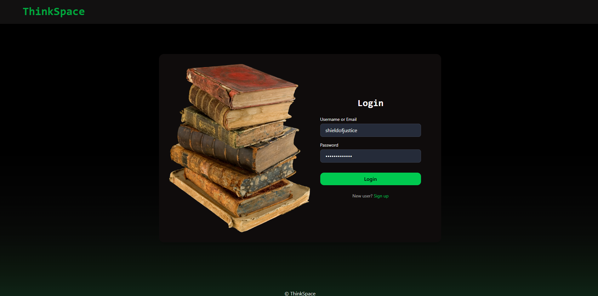
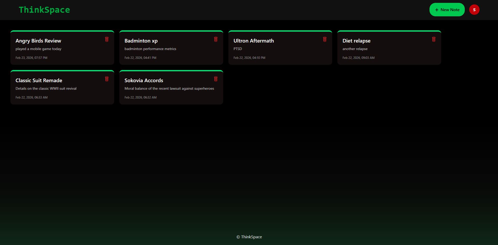
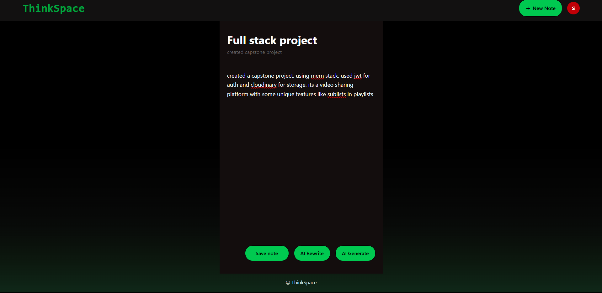
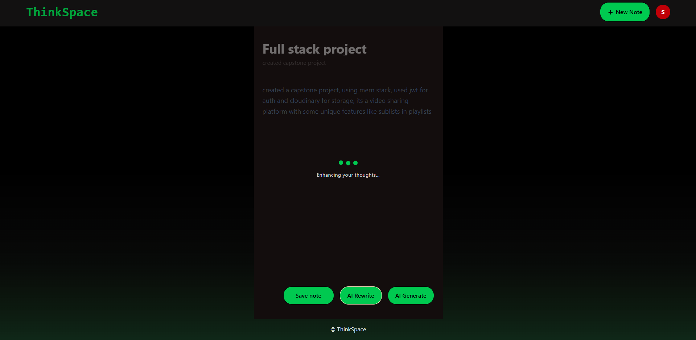
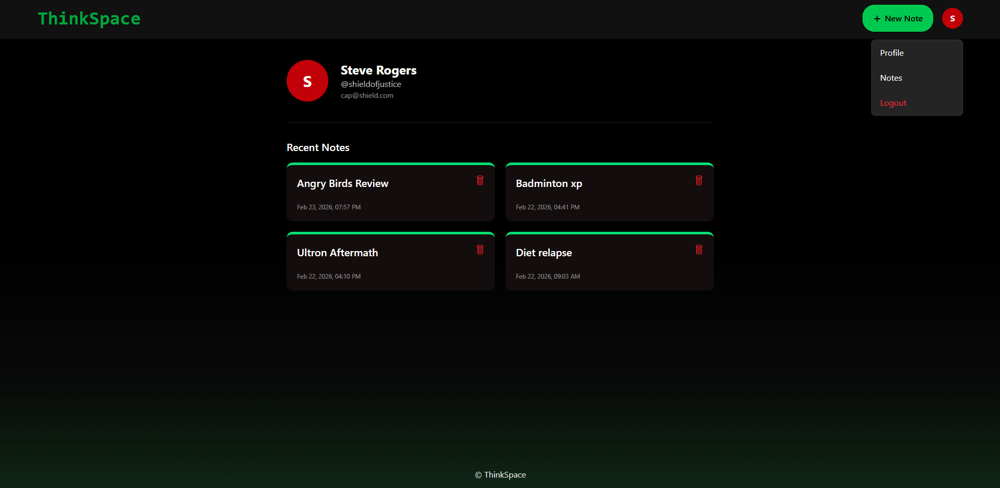

# 🧠 ThinkBoard


ThinkBoard is a **full-stack MERN journaling application** designed for how people actually think.

Most thoughts start messy — random ideas, unfinished sentences, or unstructured rambling. ThinkBoard allows you to **write freely without worrying about structure**, and then uses **AI to transform your thoughts into clear, readable notes.**

Instead of forcing structure from the start, ThinkBoard lets you **capture thoughts naturally** and refine them later using AI.

---

# ✨ Features

### 📝 Freeform Journaling
Write notes like a personal journal without worrying about formatting or structure.

### 🤖 AI Enhance
Transforms messy writing into a **clear and readable format** while preserving your tone and writing style.

### 🧠 AI Generate
Turn a few lines of **unstructured thoughts** into a complete journal entry or documentable note.

### 🔐 Secure Authentication
JWT-based authentication with **access tokens and refresh tokens**.

### 🔔 Real-Time Feedback
User-friendly **toaster notifications** for actions like login, note creation, updates, and errors.

### 🎨 Clean UI
Minimal and responsive interface built using **TailwindCSS**.

---

# 🖼️ Screenshots

## Login Page


## Notes Dashboard


## Note Editor


## AI Processing


## Profile Page


---

# 🏗️ Tech Stack

## Frontend
- React
- TailwindCSS
- React Router
- Axios
- React Toastify

## Backend
- Node.js
- Express.js
- MongoDB
- Mongoose

## Authentication
- JWT (Access & Refresh Tokens)

## AI Integration
- Google Gemini API
- OpenAI API (optional)

---

# ⚙️ Environment Variables

Create a `.env` file inside the **backend directory**.

```env
PORT=4000
NODE_ENV=development

MONGODB_URI=your_mongodb_connection_string

ACCESS_TOKEN_SECRET=your_access_token_secret
REFRESH_TOKEN_SECRET=your_refresh_token_secret

ACCESS_TOKEN_EXPIRY=15m
REFRESH_TOKEN_EXPIRY=7d

OPENAI_API_KEY=your_openai_api_key
GOOGLE_API_KEY=your_google_gemini_api_key
```

⚠️ Never commit your `.env` file to GitHub.

---

# 📦 Installation

## Clone the Repository

```bash
git clone https://github.com/Haxee24/thinkboard-ai
cd thinkboard-ai
```

---

## Install Backend Dependencies

```bash
cd backend
npm install
```

---

## Install Frontend Dependencies

```bash
cd ../frontend
npm install
```

---

# ▶️ Running the Application

To run the project locally you need **two terminals**.

### Terminal 1 — Backend

```bash
cd backend
npm run dev
```

Backend runs on:

```
http://localhost:4000
```

---

### Terminal 2 — Frontend

```bash
cd frontend
npm run dev
```

Frontend runs on:

```
http://localhost:5173
```

---

# 🧠 AI Workflow

1. User writes **raw journal thoughts**
2. AI analyzes the text
3. AI can either:
   - ✨ Enhance the writing
   - 🧠 Generate a structured journal entry
4. The improved note is saved to the database

This allows users to **document their thoughts with minimal effort.**

---

# 🎯 Purpose of the Project

ThinkBoard was built to explore how **AI can enhance everyday productivity tools.**

Instead of forcing users to write perfectly structured notes, ThinkBoard encourages:

**Think first. Organize later.**

Write messy.  
Let AI organize.

---

# 👨‍💻 Author

**Mohammed Hasan Ahmed**

Computer Science & Business Systems Student  
MERN Stack Developer  
Interested in AI-powered productivity tools

---

⭐ If you found this project interesting, consider giving it a star!